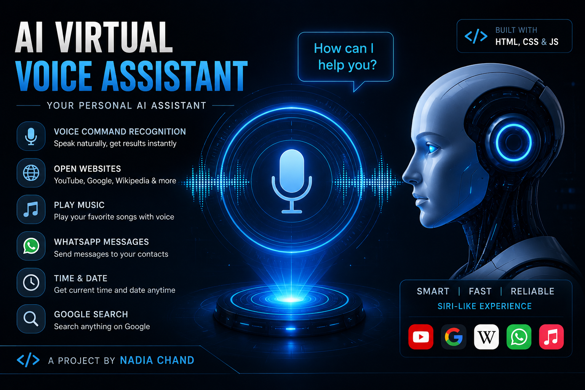

# virtual-assistant
🤖 AI Virtual Voice Assistant (google voice assistant -like)

An advanced voice-controlled AI assistant built using HTML, CSS, and JavaScript. It works like a mini Siri/Jarvis that understands voice commands and performs real-time actions like opening websites, playing music, searching Google, and sending WhatsApp messages.

🚀 Features
🎤 Voice command recognition (SpeechRecognition API)
🔊 Voice reply system (SpeechSynthesis API)
🌐 Open websites (YouTube, Google, Wikipedia, Instagram, ChatGPT etc.)
📱 WhatsApp message system
⏰ Time & Date response
🧠 Smart command parsing (Siri-like AI behavior)
🔍 Google search fallback for unknown commands
💡 How It Works
Click the microphone button 🎤
Speak your command
AI processes your voice
Performs action instantly (open site / play music / reply / search)
🛠️ Tech Stack
HTML5
CSS3
JavaScript (Vanilla JS)
Web Speech API
⚠️ Limitations
WhatsApp auto-send is not possible due to browser security rules
Works best on Google Chrome
Requires microphone permission
🎯 Project Goal

To create a browser-based Siri-like AI assistant that demonstrates real-time voice interaction and automation using JavaScript.

📌 Example Commands
"Open YouTube"
"What is time"
"Search AI technology"
👨‍💻 Developer

Link for Live - voice-assistent-4151a9.netlify.app 

Created by Nadia Chand
